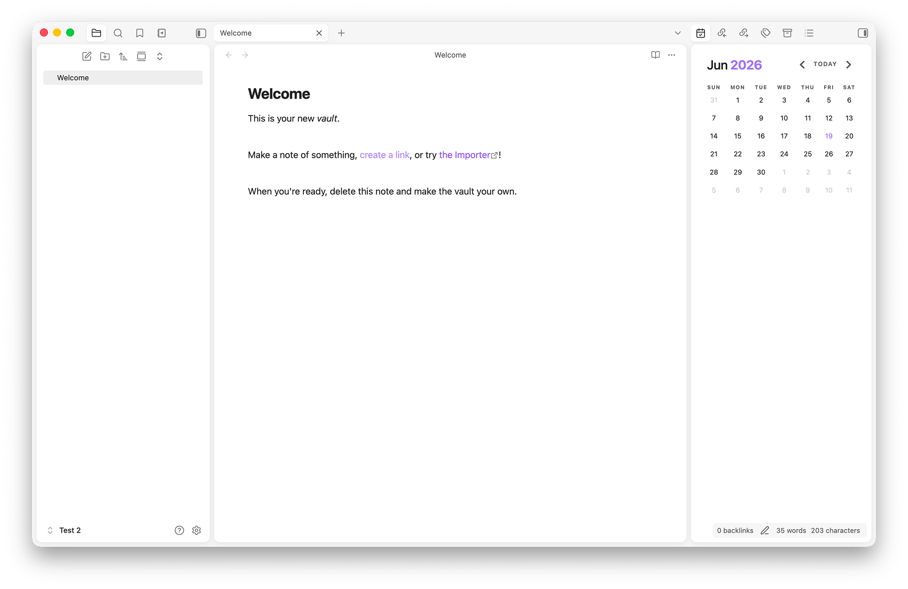
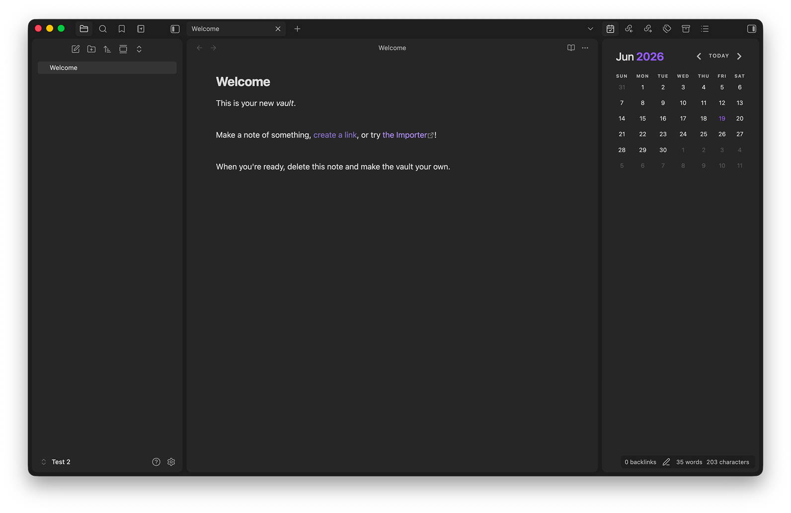

# Islands — Obsidian Theme

Modern and clean Obsidian theme Inspired by the [Islands Theme in JetBrains IDEs](https://blog.jetbrains.com/platform/2025/09/islands-theme-the-new-look-coming-to-jetbrains-ides/)

No color overrides, no font changes, just pure vibes
Desktop only

## Installation

**From Obsidian:** Settings → Appearance → Themes → Browse → search "Islands" → Install

**Manual:** Download `theme.css` and `manifest.json` from the [latest release](https://github.com/bulat-beltone/obsidian-islands-theme/releases/latest), place them in `your vault/.obsidian/themes/Islands/`

## Credits
Card layout concept from [AnuPpuccin](https://github.com/AnubisNekhet/AnuPpuccin) by AnubisNekhet
